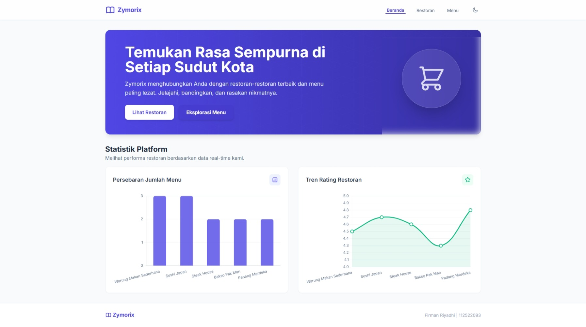
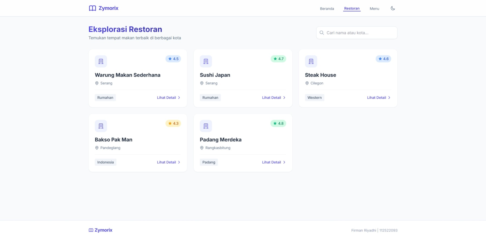
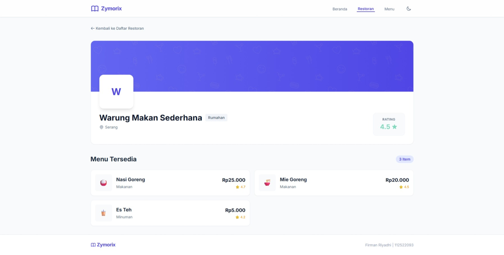
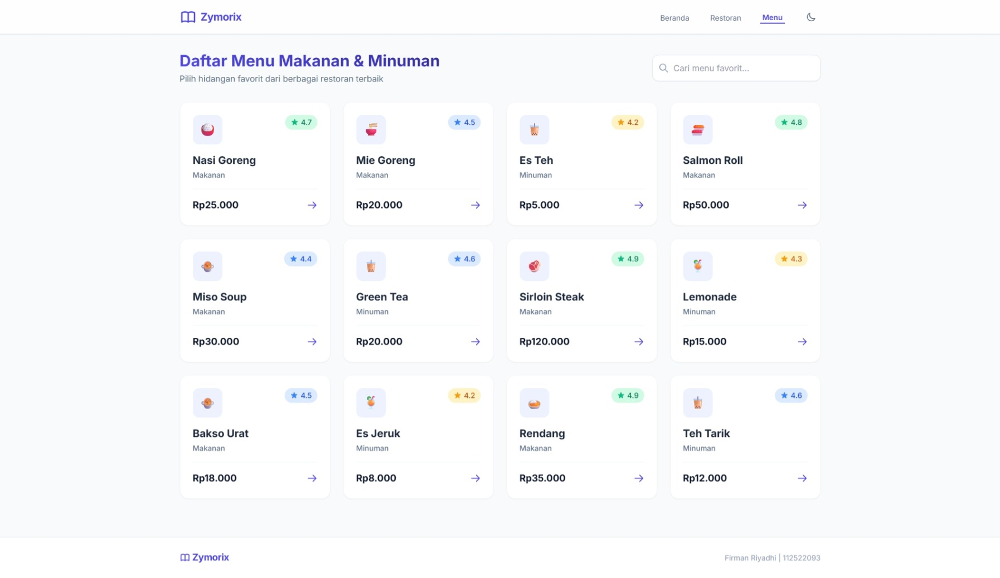
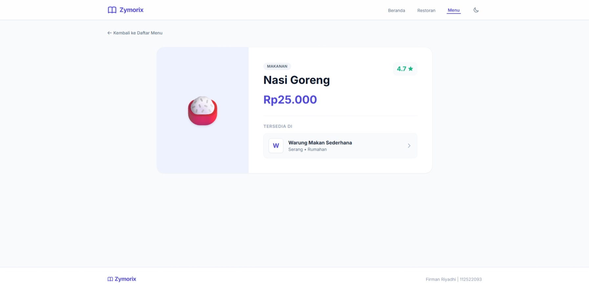

# Zymorix - Direktori Restoran

Zymorix adalah sebuah aplikasi web responsif dan modern yang berfungsi sebagai katalog atau direktori restoran. Aplikasi ini dirancang untuk memudahkan pengguna dalam mengeksplorasi berbagai pilihan restoran terbaik beserta menu hidangan unggulan mereka. 

Aplikasi ini dikembangkan menggunakan **Laravel (PHP)** untuk sisi *backend* (pengolahan logika dan rute) dan memanfaatkan teknologi *frontend* yang menyajikan antarmuka pengguna (UI) yang bersih, estetik, dan interaktif.

## 🌟 Fitur Utama

- **Antarmuka Modern & Responsif**: Desain UI yang *clean* dengan efek *glassmorphism* dan komponen visual yang menarik.
- **Mode Gelap (Dark Mode)**: Tersedia tombol *toggle* (ikon bulan) untuk mengubah tema aplikasi antara terang dan gelap, memberikan kenyamanan ekstra bagi mata pengguna.
- **Beranda Interaktif (Dashboard)**:
  - Menampilkan *banner* promosi yang menarik.
  - **Statistik Platform**: Dilengkapi dengan grafik (Bar Chart untuk persebaran jumlah menu, dan Line Chart untuk tren rating restoran) secara *real-time*.

  

- **Eksplorasi Restoran (`/restoran`)**:
  - Menampilkan daftar restoran dalam bentuk kartu (*cards*) yang rapi, memuat informasi rating, nama, lokasi, dan tipe masakan.
  - **Pencarian Cerdas**: Pengguna dapat mencari restoran berdasarkan nama atau kota tempat restoran berada.

  

- **Detail Restoran (`/restoran/{id}`)**:
  - Halaman khusus untuk setiap restoran yang menampilkan informasi lengkap dan seluruh daftar menu (Makanan/Minuman) yang tersedia di restoran tersebut.

  

- **Daftar Menu (`/menu`)**:
  - Katalog menyeluruh untuk mengeksplorasi hidangan favorit dari berbagai restoran.
  - Fitur **Pencarian Menu** untuk mencari makanan/minuman spesifik.

  

- **Detail Menu (`/menu/{id}`)**:
  - Tampilan fokus pada satu hidangan, menampilkan harga, rating, kategori, ilustrasi makanan, dan informasi restoran penyedia.

  

## 🛠️ Teknologi yang Digunakan

- **Backend**: Laravel 11 (PHP 8.x)
- **Database**: SQLite (digunakan untuk *sessions* dan migrasi dasar; data restoran dan menu saat ini menggunakan data statis di dalam Controller)
- **Frontend**: Blade Templating Engine, CSS Modern (Flexbox, Grid), dan integrasi grafik (mis. Chart.js/ApexCharts).

## 🚀 Panduan Instalasi (Local Development)

Ikuti langkah-langkah berikut untuk menjalankan proyek ini di komputer Anda:

1. **Clone repository ini**:
   ```bash
   git clone git@github.com:riyadhi-firman/Zymorix-Direktori-Restoran.git
   cd Zymorix-Direktori-Restoran
   ```
2. **Install dependency PHP (Composer)**:
   ```bash
   composer install
   ```
3. **Persiapkan Konfigurasi Lingkungan (Environment)**:
   ```bash
   cp .env.example .env
   php artisan key:generate
   ```
4. **Konfigurasi Database (SQLite)**:
   ```bash
   touch database/database.sqlite
   php artisan migrate
   ```
5. **Install dependency Node.js & Build Aset (Opsional)**:
   ```bash
   npm install
   npm run build
   ```
6. **Jalankan local server Laravel**:
   ```bash
   php artisan serve
   ```
   Aplikasi Anda sekarang dapat diakses melalui browser di alamat `http://localhost:8000`.

## 📝 Catatan Pengembangan

Saat ini Zymorix merupakan versi *purwarupa (prototype)*. Data restoran (seperti Warung Makan Sederhana, Sushi Japan, Steak House) beserta menu dan informasinya masih di-_hardcode_ secara statis di dalam file `RestoranController.php`. Penggunaan database (seperti MySQL atau PostgreSQL) dapat dengan mudah diintegrasikan di masa mendatang dengan memindahkan struktur array ke dalam model Eloquent Laravel.

## 📄 Lisensi

Proyek ini adalah *open-source* dan dilisensikan di bawah [MIT license](https://opensource.org/licenses/MIT).
